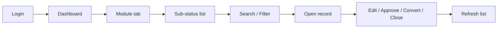
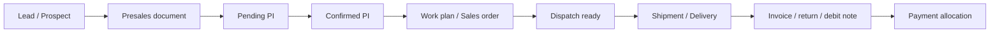
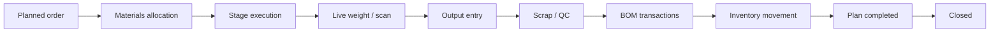
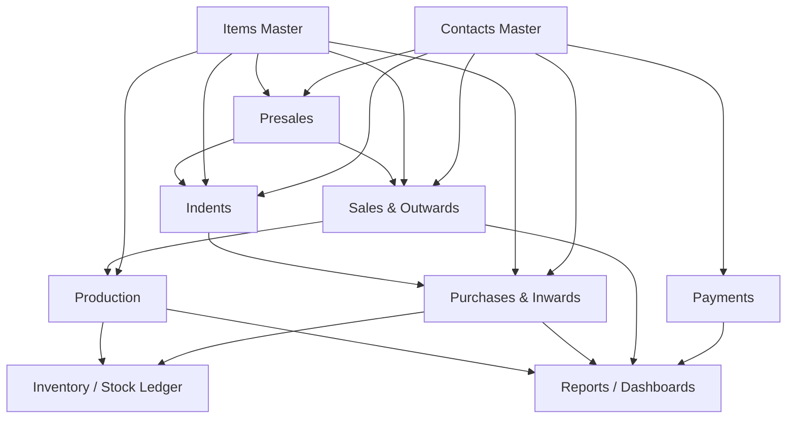

# OIMS Reverse Engineering Package

Capture date: 2026-04-27
Source system: `https://zigma.oimsapp.com/zigma/oimsapp/`
Credentials used: `view / view`

## Scope Note

This document is a functional and technical reverse-engineering summary of the live legacy application. It is based on direct browser inspection of the logged-in system, visible HTML/DOM structure, UI scripts, menu labels, form fields, status values, and AJAX route names.

Where a statement is inferred rather than explicitly observed, it is written as an inference.

## 1. Executive Summary

The application is a workflow-heavy ERP / OIMS platform built on a legacy Apache + PHP stack with a server-rendered shell and a large amount of jQuery-driven client-side behavior. The UI is organized around top-level modules, each module exposing a list view, filter panel, add/edit form, document actions, and report links.

The business domain is industrial operations with strong manufacturing, warehousing, procurement, dispatch, and accounting behavior. The product vocabulary strongly suggests a production-heavy environment involving extrusion, foil, blending, granulation, bin movement, scancode tracking, weighbridge integration, QC, GRN, and inventory movement.

The system is not a simple CRUD app. It is a document workflow engine with:

* Master data: contacts, items, warehouses, users, approval rules, reference data
* Transaction data: presales, sales orders, indents, purchase orders, purchase inward records, production orders, payments
* Workflow data: approval states, stage transitions, quick edit actions, closures, cancellations, and reverts
* Physical-operation integration: QR scanning, live weight, bin connectors, serial/packet tracking, production devices, transport/weighbridge tools
* Reporting and maintenance: GST, stock, outstanding, production, payment, activity, and repair tools

The best replication strategy in React + Django is not to clone screens one by one. It is to extract the shared document engine, workflow state machine, master data model, and report layer, then build module-specific screens on top of those primitives.

## 2. Observed Platform Architecture

### 2.1 Stack and shell behavior

Observed indicators:

* Apache response headers
* PHP session cookie (`PHPSESSID`)
* Hidden session-related fields in the page DOM, including `sessionUID`
* Client-side permission logic driven by a concatenated `userTitle` string
* jQuery-style DOM manipulation, hidden views, and AJAX endpoints under module-specific paths

The application behaves like a server-rendered shell that swaps module views in place rather than doing full page reloads for every action.

### 2.2 Main UI containers

After login, the shell exposes major view containers such as:

* `#home_view`
* `#contact_view`
* `#item_view`
* `#saledoc_view`
* `#ordersaledoc_view`
* `#production_view`
* `#indentsaledoc_view`
* `#purchasesaledoc_view`
* `#payment_view`

There are also hidden administrative or support views for activity, users, settings, and reports.

### 2.3 Navigation model

The top-level module tabs are:

* Contacts
* Items
* Presales
* Sales & Outwards
* Production
* Indents
* Purchases & Inwards
* Payments
* Dashboard

The top bar also exposes utility links such as Quick Capture, Tickets Analyzer, and Sign Out.

## 3. Business Domain

### 3.1 Primary purpose

The app appears to manage the full operational lifecycle of an industrial business:

* Customer and supplier master data
* Product/item master data
* Sales lead and quotation flow
* Sales order and dispatch flow
* Purchase request and purchase order flow
* Goods receipt and inward flow
* Production planning and stage tracking
* Payment, receipt, journal, contra, and expense accounting
* Operational and statutory reporting

### 3.2 Business characteristics inferred from the UI

These behaviors point to a manufacturing and distribution business rather than a plain trading app:

* Production stage names and output/reprint restrictions
* Weight calculations, batch tracking, and live serial/scan integration
* GRN, gate entry, QC, material inward, and warehouse transfer flow
* Bin connection, packet/meter stock reporting, and scancode history
* GST reporting, debit note/credit note handling, and invoice numbering tools

### 3.3 Master data domains

The application uses master data aggressively. Contacts and items are not isolated records; they are the base for almost every transaction:

* Contacts become customers, suppliers, shippers, dealers, distributors, service providers, or ledgers
* Items become sale items, purchase items, BOM components, production inputs/outputs, or stock units
* Segments, sub-segments, lead source, payment terms, price books, warehouses, and branches are shared reference data

## 4. Menu Tree and Functional Areas

### 4.1 Top-level module tree

```text
OIMS
├── Dashboard
├── Contacts
│   ├── All
│   ├── Leads
│   ├── Prospect
│   ├── Customers
│   ├── Suppliers
│   ├── Dealers
│   ├── Distributors
│   ├── Shippers
│   ├── Service Providers
│   ├── General Ledgers
│   ├── Zigma Units
│   ├── Unapproved Customer
│   └── Archived Contacts
├── Items
│   ├── Profiles
│   ├── Accessories
│   ├── Consumables
│   ├── General Items
│   ├── HR Items
│   ├── IT
│   ├── Stationery Items
│   ├── Admin
│   ├── Scrap Item
│   ├── Blend Item
│   ├── Maintenance Items
│   ├── Raw Materials
│   ├── Development
│   ├── Production Stages
│   ├── Production Types
│   └── All
├── Presales
│   ├── All
│   ├── Pending PI
│   ├── Confirmed PI
│   ├── Partially Reserved PI
│   ├── Fully Reserved PI
│   ├── Ready for Dispatch
│   ├── Sales Orders
│   ├── Dispatch In progress
│   ├── Store Requests
│   ├── Approved SR
│   ├── Purchase Requests
│   ├── Approved PR
│   ├── Closed Won
│   ├── Cancelled PI
│   ├── Lost
│   ├── Inviable
│   └── Templates
├── Sales & Outwards
│   ├── All
│   ├── Open Orders
│   ├── Despatch Ready
│   ├── Shipped
│   ├── Delivered
│   ├── Material Out
│   ├── Cancelled Orders
│   ├── Cancelled Invoices
│   ├── Returns
│   ├── Debit Note
│   ├── IUT Open Orders
│   ├── IUT Shipped
│   ├── IUT Delivered
│   └── IUT Delivered (Scanned)
├── Production
│   ├── All
│   ├── In Progress
│   ├── Planned
│   ├── Plan Completed (Ready to Close)
│   └── Closed
├── Indents
│   ├── All
│   ├── Indents
│   ├── Purchase Quotes
│   ├── Executive Approval
│   ├── Pending (PM Approval)
│   ├── Pending (PH Approval)
│   ├── Pending (GM Approval)
│   ├── Pending (MD Approval)
│   ├── Purchase Orders
│   ├── Processed Orders
│   ├── Cancelled PO
│   └── Purchase Templates
├── Purchases & Inwards
│   ├── Goods in Transit
│   ├── Gate Entry
│   ├── GRN Process
│   ├── QCR
│   ├── GRN Scan
│   ├── GRN
│   ├── GRN (Manual)
│   ├── Material In
│   ├── Purchase Inward
│   ├── Cancelled Orders
│   ├── Cancelled GRN
│   ├── Purchase Returns
│   ├── IUT In Transit
│   ├── IUT Received
│   ├── IUT Scan On
│   ├── IUT Scanned
│   ├── IUT In Transit (Archived)
│   └── All
└── Payments
    ├── All
    ├── Receipts
    ├── Payments
    ├── Credit Notes
    ├── Debit Notes
    ├── Journals
    ├── Contra
    └── Expenses
```

### 4.2 Dashboard shortcut groups

The home dashboard is also a launcher for operational and reporting shortcuts grouped as:

* Transaction based reports
* Document based reports
* Other reports
* Account check tools
* Showcase
* GST reports
* Summary reports
* Tools
* Custom links

This is a strong signal that the dashboard is an operations portal, not just a KPI screen.

## 5. User Flow Analysis

### 5.1 Common navigation flow

The standard user journey is:

1. Login
2. Land on home/dashboard
3. Pick a top-level module tab
4. Pick a sub-status tab
5. Search or filter list data
6. Open a record or create a new one
7. Save, approve, reject, convert, close, or print
8. Return to the filtered list with updated status

The shell is optimized for task execution, not browsing. Every module begins with a filtered list and then transitions to a detail form or workflow action.

### 5.2 Dashboard flow

The dashboard acts as:

* A module launcher
* A report launcher
* A maintenance tool launcher
* A shortcut hub for production, stock, demand, and accounting tasks

The dashboard likely routes users by role and current business need rather than by pure hierarchy.

### 5.3 Module access flow

Observed access pattern:

* Module visibility is controlled both by top-level tabs and client-side button removal
* Certain actions only appear when the `userTitle` string includes specific permission titles
* Some actions are conditionally removed from the DOM rather than only hidden visually

Important inference:

* The backend must still enforce permissions even if the UI hides buttons
* The live app currently appears to rely heavily on front-end gating, which is risky

### 5.4 Approval flow

Approvals are stateful and role-dependent.

Observed approval-related permission titles include:

* Approved SR
* Approve Work Plan
* Approve Indent
* Approve PI
* Approve SO
* PO Approver
* Contact Verify
* Contact Approve
* Demand Planner
* Demand Full View
* Amended PO
* Revert PR
* DiscTax
* EditInvoice
* Take Inward
* Recreate

Observed behavior:

* Buttons such as `create-workplan`, `convert-to-purchaseorder`, `edit-invoice-details`, and `recreate-trans-btn` are shown or removed according to permission
* Purchase approval follows a 4-stage chain
* Contact approval depends on verification and approval flags
* Production actions are limited by stage and by role

### 5.5 Reporting flow

Reporting is accessible from:

* Dashboard report groups
* Module-specific report links
* Maintenance and account-check tools

The pattern is:

1. Open report
2. Apply filters
3. Generate table or HTML report
4. Export / print / PDF if needed
5. Drill down into document or transaction history

### 5.6 Admin flow

The system includes hidden or elevated administrative areas for:

* Activity logs
* User management
* Settings
* Financial year setup
* Maintenance / fix tools
* Bulk imports

These are not simple CRUD screens; they are operational support tools for correcting and sustaining live transaction data.

## 6. Permission and Role Model

### 6.1 Observed permission model

The application uses a coarse permission system where the current user has a string of comma-separated titles, and the client script checks for substring presence.

This is effectively an ABAC/RBAC hybrid:

* Role or permission titles are embedded in a user context string
* UI actions are enabled or removed according to title membership
* Workflow transitions depend on those titles

### 6.2 Permissions observed in the live session

Observed titles include:

* Reports Admin
* viewpackets
* Custom Links
* Approve Work Plan
* Take Inward
* Approve Indent
* PO Approver
* Contact Verify
* Contact Approve
* DiscTax
* Approved SR
* Amended PO
* Revert PR
* Demand Planner
* Approve PI
* Approve SO
* Demand Full View

### 6.3 Client-side gating rules inferred

The front end uses title checks to:

* Hide or show workflow actions
* Remove certain tabs entirely
* Restrict BOM access
* Change default contact or document type
* Control access to invoice edit and re-create functions

### 6.4 Security recommendation for the target stack

In React + Django, this should become:

* Django authentication and permission classes
* Server-side transition validators
* Branch and warehouse-level access checks
* Audit logging on every workflow action
* Row-level filters for list views and reports

## 7. Module-Wise Functional Documentation

## 7.1 Contacts

### Purpose

Contacts are the master identity layer for:

* Customers
* Leads
* Prospects
* Suppliers
* Dealers
* Distributors
* Shippers
* Service providers
* General ledgers
* Zigma units

### List view behavior

Observed list table columns:

* Ref#
* Name
* Phone

Observed list features:

* Global search box
* Show all
* Add new
* Hide selected
* Search
* Show filters
* Search with filter
* Reset filters
* Alphabet shortcuts for quick navigation

Key filters observed:

* Contact type
* Contact id
* Created/updated by
* Contact filter
* Lead source
* Contact name
* Info filter
* Segment
* Sub-segment
* Segment keyword
* Created from/to
* Sales rep id
* Customer loyalty

### Form structure

Important fields observed in the contact form:

* `contact_name` required
* `display_name`
* `duplicate_verification_status`
* `code`
* `acc_per`
* `tds_category`
* `tds_per`
* `website`
* `locationmap_link`
* `approved_status`
* `is_msme_registered`
* `receiving_autoinward`
* `marketplace`
* `pan_no`
* `aadhar_no`
* `vat_tin_no`
* `state_name`
* `state_code`
* `special_tax_status`
* `price_book`
* `payment_terms`
* `credit_limit`
* `contact_type` required
* `category` required
* `customer_loyalty` required
* `division`
* `segment` required
* `sub_segment` required
* `segment_keyword`
* `lead_source` required
* `sales_contact_id` required
* `currency` required
* `preferred_shipper_id`
* `preferred_shipper`
* `commission_per`
* `has_custitems`
* `contact_identifier`
* `onetime_invoice`
* `zigma_contact_id`
* `full_name` required for the first contact person row
* `work_phone` required
* `email`
* `default` person radio
* verification fields: requested datetime, verified status, verified datetime, verified phone, verified email
* address composer fields
* bank profile fields
* scanned resources uploader
* notes
* audit fields: created on, created by, ip

### Business rules

Observed and inferred rules:

* Contact type is not static. It changes based on approval and verification state
* A customer may be forced to `unapproved` unless verification or override rules pass
* Phone and email verification affect approval status
* Payment terms can become non-mandatory when approval flow changes
* The address field is presented as read-only and is expected to be composed through the address composer
* The module supports multiple persons and multiple addresses per contact

### Parent-child structure

Recommended conceptual structure:

* Contact
* ContactPerson
* ContactAddress
* ContactBankProfile
* ContactVerification
* ContactAttachment

### Downstream dependencies

Contacts feed:

* Sales and presales
* Purchasing and suppliers
* Payment account mapping
* Shipping and transporter selection
* Ledger/accounting flows

## 7.2 Items

### Purpose

Items are the product, raw material, and production master. The item module is broader than a standard stock item table; it includes pricing, BOM, stages, production settings, specification data, and resource links.

### List view behavior

Observed columns:

* Ref#
* Inv.
* Item Name
* Brand
* On Hand

Observed filters:

* Item search string
* Item id
* Item type
* Item name
* Inventory type
* Model
* Part number
* Main category
* Category
* Brand
* Parent item
* Created/updated by
* Item status

### Form structure

Important fields observed:

* `item_id`
* `brand` required
* `model`
* `hsn_code` required
* `item_name` required
* `item_alias`
* `item_commonname`
* `item_code`
* `sequence`
* `item_short_description`
* `item_purchase_description`
* BOM variant fields
* process fields
* property fields
* item division
* length / width / pieces / alt length / section weight / tolerance / weights / loss
* `access_customer_id`
* `label_with_picture`
* latest purchase price/date/reference/supplier
* `item_type` required
* `item_prdn_type`
* main category / subcategory
* series category
* issue type
* BOM quantity multiplier
* `scannable`
* `weighable`
* pick-by mode
* parent item reference
* `is_parent`
* `no_of_children`
* `upc`
* `scancode`
* `item_status` required
* price fields
* unit fields
* alt unit conversion fields
* pack size and tax/warranty fields
* BOM item picker
* default BOM variant
* BOM group settings

### Business rules

Observed and inferred rules:

* BOM access is permission-gated
* Item ID generation appears to be series-based and dependent on item category/type/property
* Parent-child item relationships exist
* Item type and production type drive visible tabs and calculations
* Some production-related item types likely map to special stock or stage behaviors

### Parent-child structure

Recommended conceptual structure:

* Item
* ItemCategory
* ItemBrand
* ItemUnit
* ItemPrice
* ItemSpecification
* ItemBOMVariant
* ItemBOMComponent
* ItemResource

### Downstream dependencies

Items feed:

* Presales and sales line items
* Purchase line items
* Production materials and outputs
* Stock ledger
* BOM and stage configuration

## 7.3 Presales

### Purpose

Presales is the opportunity / pre-order / quotation pipeline. The sub-statuses indicate a funnel from pending PI through closed won, lost, inviable, and templates.

### List view behavior

Observed columns:

* P
* O
* Ref#
* Project
* Amount
* Date

Observed filters:

* Search by id, customer, items, or total amount
* Document type
* Entity section
* Branch
* Customer
* Customer address
* Items
* Terms
* Segment / sub-segment / segment keyword
* Warehouse
* Sale category
* Payments / payment details
* Min/max amount
* Sales rep
* Invoice contact
* Priority / need
* Base order id
* Base customer id
* Base plan id
* Plan id
* Lead source
* Customer PO
* Date range filters

### Form structure

Observed sections and tabs:

* General
* Items
* Terms
* Sales BOM
* Forms
* Payments
* Resources
* Notes
* PDFs
* Opportunity
* Invoice / Order details
* Receiving Warehouse Details
* Requirement
* Customer Information
* Details
* Shipping Terms
* Payment Terms
* Terms of Sale
* Packing Terms
* Forms to receive
* Forms to issue

Important fields observed:

* `branch_id` required
* `saledoc_type` required
* `sale_type`
* `orderprocess_status`
* base order / customer relations
* `transaction_type`
* `sale_category`
* `ledger_id`
* `project_name`
* `version_number`
* `opportunity_description`
* `opportunity_need` required
* `opportunity_priority`
* `priority`
* `gross_profit_per`
* `gross_profit_val`
* segment fields
* `status`
* invoice number fields
* `sdid`
* `order_conversion_days`
* `warehouse` required
* destination warehouse
* delivery note and sales return fields
* commercial invoice amount
* fulfilled date
* destination contact
* destination sale type
* destination bin/lot
* destination saledoc stage
* destination autoinward
* destination restrict item transfer
* inward id
* requirement section fields
* customer/supplier linkage fields
* capex fields
* despatch summary fields
* customer PO fields
* invoice contact

### Business rules and workflow

Observed workflow signals:

* `Approved SR` permission is required for some transitions
* `Approve Work Plan` controls work plan creation
* `Approve Indent` controls purchase order conversion
* `EditInvoice` controls invoice detail editing
* `Recreate` controls record recreation
* `Demand Planner` and `Demand Full View` control planning visibility
* `Amended PO` and `Revert PR` control special purchase-side actions
* `DiscTax` likely controls discount and tax modifications

The presales module is therefore not only a quoting screen. It is the source document for downstream production planning, sales order creation, and procurement requests.

### Parent-child structure

Recommended conceptual structure:

* PresaleHeader
* PresaleLine
* PresaleTerm
* PresaleFormLink
* PresalePaymentLink
* PresaleAttachment
* PresaleApproval

### Downstream dependencies

Presales can lead to:

* Sales order
* Dispatch
* Work plan
* Store request
* Purchase request / indent
* Closed won / lost / cancelled states

## 7.4 Sales & Outwards

### Purpose

Sales & Outwards appears to manage confirmed sales, dispatch, shipment, delivery, returns, debit notes, and inter-unit transfers.

### List view behavior

Observed columns:

* P
* O
* Ref#
* Project
* Amount
* Pro.
* Pay
* Date

Observed filters and actions are similar to presales, with sales-specific status and date handling.

### Form structure

The shared document form includes:

* General
* Items
* Terms
* Forms
* Shipping
* Payments
* Resources
* Notes
* PDFs
* Bill-related sections
* Invoice / Order details
* Requirement
* Supplier Information
* Details
* Shipping Terms
* Payment Terms
* Terms of Purchase
* Packing Terms
* ewaybill details
* Forms to receive
* Forms to issue
* Customer Details
* Transporter Details
* Shipment

Important fields seen or implied:

* Delivery note fields
* Sales return fields
* Debit note fields
* Commercial invoice fields
* Dispatch loading and audit fields
* Packing and verification fields
* Destination warehouse and contact fields
* Customer PO data
* Invoice contact

### Business rules

Sales-side actions are driven by document status and user permission. The module supports:

* Open order
* Dispatch ready
* Shipped
* Delivered
* Material out
* Cancelled order / invoice
* Returns
* Debit note
* IUT flow

### Downstream dependencies

Sales & Outwards feeds:

* Shipping reports
* Stock reduction
* Production demand
* Invoice generation
* Returns and credit/debit adjustments

## 7.5 Production

### Purpose

Production is the manufacturing execution layer. It is stage-based, weight-aware, and tightly integrated with scanning, batch transactions, output capture, and BOM consumption.

### List view behavior

Observed columns:

* Prd ID
* L
* S
* Production
* Pro.
* Date

Observed filters:

* Search any production order
* Production type
* Production id
* Prdn type
* Items
* Production status
* Production line number
* Shift
* Batch number
* Date range
* Base order / customer / plan filters

### Process behavior observed from scripts

Important script-driven behaviors:

* Quantity conversion is derived from length, width, number of pieces, section weight, and production type
* Special handling exists for foil slit and blending-related flows
* Output creation triggers `outputAdded`
* Output creation can trigger:
  * packing stage quantity updates
  * BOM transaction auto-creation
  * reprint restriction logic
  * serial / packet communication through an iframe and `postMessage`
* The module uses `quickSave`, `get_balance_weight`, `handle_stage_transactions`, and `reset_prdn_batch_trans`

### Inferred sub-areas

Based on script names and UI patterns, the production form likely includes:

* General
* Materials
* Output
* Scrap
* Stage tracking
* Resources
* Notes
* QC or process-line dialogs

### Business rules

Production is not a generic task list. It is a controlled state machine:

* Planned
* In progress
* Plan completed / ready to close
* Closed

Certain production types switch visible sections:

* Blend types show `for-blend`
* Foil types show `for-foil`
* Other types show `for-others`

Some actions are restricted by role, stage, or line/batch state.

### Downstream dependencies

Production feeds:

* Inventory stock movement
* Bin connectors
* QC and scrap tracking
* Outputwise reports
* Stagewise reports
* Packing and label generation

## 7.6 Indents

### Purpose

Indents are procurement requests and purchase planning documents. They bridge demand planning and purchasing.

### List view behavior

Observed columns:

* P
* O
* Ref#
* Project
* Amount
* Date

### Approval chain

The hidden approval JSON and visible status names indicate a four-level approval model:

* PM Approval
* PH Approval
* GM Approval
* MD Approval

The JSON maps to transitions such as:

* unapproved -> l1 approved
* l1 approved -> l2 approved
* l2 approved -> l3 approved
* l3 approved -> l4 approved
* l4 approved -> purchase order or final order state

### Purchase categories observed

The search UI shows categories such as:

* Indent
* Domestic Purchase
* Import Purchase
* Work Order
* Amended Order
* Amended Order (Import)
* Pro (HYD) Purchase
* Pro (DEL) Purchase
* RM In Slip
* FG In Slip
* Cash Purchase

### Downstream dependencies

Indents feed:

* Purchase quotes
* Purchase orders
* Purchase approvals
* Purchasing and inward flows
* Procurement reporting

## 7.7 Purchases & Inwards

### Purpose

Purchases & Inwards is the inbound goods and procurement execution module. It includes gate entry, GRN, QC, scanning, inwarding, returns, and inter-unit transfers.

### List view behavior

Observed default status filtering indicates `purorder open`, with additional sub-status tabs for:

* Goods in Transit
* Gate Entry
* GRN Process
* QCR
* GRN Scan
* GRN
* GRN Manual
* Material In
* Purchase Inward
* Cancelled Orders
* Cancelled GRN
* Purchase Returns
* IUT In Transit
* IUT Received
* IUT Scan On
* IUT Scanned
* IUT In Transit (Archived)

### Form structure

Observed sections:

* General
* Items
* Terms
* Forms
* Shipping
* Payments
* Resources
* Notes
* PDFs
* Bills
* Invoice / Order details
* Requirement
* Supplier Information
* Details
* Shipping Terms
* Payment Terms
* Terms of Purchase
* Packing Terms
* ewaybill Details
* Forms to receive
* Forms to issue
* Customer Details
* Transporter Details
* Shipment

Important fields observed:

* `branch_id` required
* `saledoc_type`
* `sale_type`
* many inbound invoice and return numbering fields
* `orderprocess_status`
* base order/customer relations
* `transaction_type`
* `sale_category`
* `ledger_id`
* `project_name`
* `version_number`
* `opportunity_need`
* `opportunity_priority`
* `priority`
* segment fields
* commercial invoice fields
* `merged_ids`
* `delivery_days_gap`
* `supplier_invoice_no`
* `supplier_invoice_date`
* `order_delivery_rating`
* `gateentry_no`
* `gateentry_datetime`
* `qc_datetime`
* `warehouse`
* `source_warehouse`
* `accepted_warehouse`
* `rejected_warehouse`
* `delivery_note_no`
* `salesreturn_no`
* `note_no`
* `commercial_invoice_amount`
* `fulfilled_date`
* requirement section fields
* approval JSON
* contact linkage fields
* capex fields
* gate entry book number/date
* declaration
* total in words
* dispatch summary fields
* customer PO fields
* debit note fields
* destination and invoice contact

### Business rules

Observed business logic includes:

* Gate entry capture
* GRN process and manual GRN paths
* QC path
* Material inward path
* Purchase return and cancellation path
* IUT scanning and archiving
* Role-gated actions such as gate entry and inward acceptance

### Downstream dependencies

Purchases & Inwards feeds:

* Stock increase
* QC reports
* Material receiving reports
* Supplier purchase reports
* Payables and payment allocation
* Audit and exception tools

## 7.8 Payments

### Purpose

Payments is a financial transaction module covering receipts, payments, notes, journals, contra entries, and expenses.

### List view behavior

Observed columns:

* Pay#
* Date
* Mode
* Towards Account
* Type
* Pay
* Amount

Observed filters:

* Payment type
* Payment id
* Pay type id
* PT type
* Pay type
* Account name
* Account id
* Invoice no
* Reference no
* Payment mode
* Payment notes
* Allocated status
* Amount range
* Date range
* Cheque details

### Form structure

Observed tabs:

* General
* Resources
* Payment Info
* Payment Details
* Expenses
* Allocations

Important fields observed:

* `branch_id` required
* `payment_type-disp` required
* `pay_type` required
* `payment_date_display` required
* `payment_amount-disp` required
* account selection fields
* debit and credit account fields
* expense account fields
* payment mode required
* cheque date, cheque number, cheque bank
* payment notes
* external reference number
* base reference id/module/project
* payment schedule
* payment type
* `is_expense`
* contact fields
* customer state code
* customer special tax status
* allocation totals
* expense category/type fields
* tax split fields
* rounded off price
* payment amount
* `do_allocate`
* `has_taxes`
* scanned payment receipt uploader
* audit fields

### Business rules

The payment module supports:

* Receipts
* Payments
* Credit notes
* Debit notes
* Journals
* Contra
* Expenses

Allocation and tax breakdown are first-class functions, not afterthoughts.

### Downstream dependencies

Payments feed:

* Outstanding reports
* Accounts reports
* Invoice allocation tracking
* Tax and statutory reporting
* Receipt and expense audits

## 7.9 Dashboard, Reports, Tools, Admin

### Dashboard and report categories

Observed report families include:

* Transaction based reports
* Document based reports
* Other reports
* Account check tools
* Showcase
* GST reports
* Summary reports
* Tools
* Custom links

### Important operational report categories

Examples include:

* Sales reports
* Purchase reports
* Daily report
* Sales summary
* Purchase summary
* Opportunity pipeline report
* Indent pipeline report
* Presales pipeline report
* Customer sales report
* Supplier purchase bill / supplier activity report
* Payments and advance payment reports
* Receivables and payables
* Outstanding reports
* Customer and supplier reports
* Item stock and non-moving reports
* Service schedule report
* Activity and expense reports
* GST invoice and HSN reports

### Maintenance and admin tools

Examples include:

* Payment mismatch
* Find/fix wrong or missing transactions
* Bulk import contacts, items, users, payments
* Financial year setup
* Update invoice / DC / return numbers
* Transaction history
* Items without images
* Demand sheet
* Stock transfer / split / manage stock

## 8. User Journey Maps

### 8.1 Generic record lifecycle



### 8.2 Sales / presales journey



### 8.3 Procurement journey

```mermaid
flowchart LR
  A[Indent] --> B[Purchase quote]
  B --> C[PM Approval]
  C --> D[PH Approval]
  D --> E[GM Approval]
  E --> F[MD Approval]
  F --> G[Purchase order]
  G --> H[Gate entry]
  H --> I[GRN / QCR]
  I --> J[Material in]
  J --> K[Purchase inward closed]
  K --> L[Payment / payable]
```



### 8.4 Production journey



## 9. Process Flow Mapping

### 9.1 Cross-module dependency map



### 9.2 Parent-child relationships between forms

Observed and inferred parent-child chains:

* Contact -> Person(s)
* Contact -> Address(es)
* Contact -> Bank profile(s)
* Contact -> Attachment(s) / scanned resources
* Item -> Price record(s)
* Item -> BOM variant(s)
* Item -> BOM component(s)
* Item -> Specification(s)
* Item -> Resource(s)
* Document header -> Line item(s)
* Document header -> Term(s)
* Document header -> Form links
* Document header -> Resource(s) / PDF(s)
* Document header -> Approval history
* Production order -> Stage rows
* Production order -> Material rows
* Production order -> Output rows
* Production order -> Scrap rows
* Production order -> Batch transactions
* Payment -> Allocation(s)
* Payment -> Tax split(s)
* Payment -> Expense detail(s)

### 9.3 Approval dependencies

Observed approval dependency chain examples:

* Contact verification must happen before contact promotion in some cases
* Indent approvals must pass through a four-level chain before PO creation
* Sales and purchase actions are gated by document stage and permission
* Production output actions are gated by stage, weight, and role

## 10. Functional Database Understanding

### 10.1 Likely master tables

Suggested master entities:

* Contact
* ContactPerson
* ContactAddress
* ContactBankProfile
* ContactVerification
* Item
* ItemBrand
* ItemCategory
* ItemUnit
* ItemPrice
* ItemSpecification
* ItemBOMVariant
* ItemBOMComponent
* Warehouse
* Branch
* Currency
* PaymentTerms
* TaxCode
* LeadSource
* Segment
* SubSegment
* ApprovalRole
* UserProfile
* ProductionType
* ProductionStageDefinition

### 10.2 Likely transaction tables

Suggested transactional entities:

* DocumentHeader
* DocumentLine
* DocumentTerm
* DocumentFormLink
* DocumentResource
* DocumentApproval
* DocumentStatusHistory
* ProductionOrder
* ProductionStageRow
* ProductionMaterialRow
* ProductionOutputRow
* ProductionScrapRow
* ProductionBatchTransaction
* InventoryTransaction
* StockLedger
* GateEntry
* GRN
* QCInspection
* Payment
* PaymentAllocation
* PaymentTaxSplit
* ExpenseEntry
* AuditLog
* Notification

### 10.3 Normalization recommendation

Because many forms share the same header, line, approval, and resource behavior, the best Django model design is:

* An abstract base model for common audit fields
* A shared document header model for repeated document-level fields
* Module-specific one-to-one extension models where needed
* A generic attachment/resource model
* A status history table instead of only storing the current state

This avoids the anti-pattern of one giant denormalized table with hundreds of nullable columns.

### 10.4 Suggested Django model shape

```text
AbstractAuditModel
  created_on
  created_by
  updated_on
  updated_by
  ip_address

Contact
ContactPerson
ContactAddress
ContactBankProfile
ContactVerification

Item
ItemPrice
ItemBOMVariant
ItemBOMComponent
ItemSpecification
ItemResource

DocumentHeader
DocumentLine
DocumentTerm
DocumentResource
DocumentApproval
DocumentStatusHistory

ProductionOrder
ProductionMaterialRow
ProductionStageRow
ProductionOutputRow
ProductionScrapRow
ProductionBatchTransaction

InventoryTransaction
WarehouseStock
GateEntry
GRN
QCInspection

Payment
PaymentAllocation
PaymentTaxSplit
ExpenseEntry

WorkflowRule
WorkflowTransition
Notification
ReportCache
```

### 10.5 ER diagram

```mermaid
erDiagram
  CONTACT ||--o{ CONTACT_PERSON : has
  CONTACT ||--o{ CONTACT_ADDRESS : has
  CONTACT ||--o{ CONTACT_BANK_PROFILE : has
  CONTACT ||--o{ DOCUMENT_HEADER : referenced_by

  ITEM ||--o{ ITEM_PRICE : has
  ITEM ||--o{ ITEM_BOM_COMPONENT : parent_of
  ITEM ||--o{ ITEM_SPECIFICATION : has
  ITEM ||--o{ DOCUMENT_LINE : referenced_by
  ITEM ||--o{ PRODUCTION_MATERIAL_ROW : consumed_by
  ITEM ||--o{ PRODUCTION_OUTPUT_ROW : produced_by

  DOCUMENT_HEADER ||--o{ DOCUMENT_LINE : contains
  DOCUMENT_HEADER ||--o{ DOCUMENT_TERM : contains
  DOCUMENT_HEADER ||--o{ DOCUMENT_APPROVAL : tracked_by
  DOCUMENT_HEADER ||--o{ DOCUMENT_RESOURCE : stores
  DOCUMENT_HEADER ||--o{ PAYMENT_ALLOCATION : settled_by

  PRODUCTION_ORDER ||--o{ PRODUCTION_STAGE_ROW : consists_of
  PRODUCTION_ORDER ||--o{ PRODUCTION_MATERIAL_ROW : consumes
  PRODUCTION_ORDER ||--o{ PRODUCTION_OUTPUT_ROW : produces
  PRODUCTION_ORDER ||--o{ PRODUCTION_SCRAP_ROW : generates
  PRODUCTION_ORDER ||--o{ PRODUCTION_BATCH_TRANSACTION : batches

  PAYMENT ||--o{ PAYMENT_ALLOCATION : allocates
  PAYMENT ||--o{ PAYMENT_TAX_SPLIT : splits

  WAREHOUSE ||--o{ INVENTORY_TRANSACTION : records
  WAREHOUSE ||--o{ WAREHOUSE_STOCK : holds
```



## 11. API and Backend Logic Estimation

### 11.1 Backend capabilities required

The Django backend should support:

* CRUD for all master entities
* CRUD for document headers, lines, terms, resources, and attachments
* Status transitions with permission checks
* Workflow approvals and rejections
* Convert actions between modules
* Search and filter queries for list screens
* Report generation and export
* Dashboard KPI aggregation
* Notification dispatch
* Audit logging
* File upload and scanned document storage
* Inventory recalculation and stock ledger writes
* Production output and BOM auto-transaction creation
* Device integration endpoints for scanners, live weight, and serial communication

### 11.2 Suggested REST endpoint structure

```text
/api/auth/login
/api/auth/logout
/api/auth/me
/api/auth/permissions

/api/contacts
/api/contacts/{id}
/api/contacts/{id}/approve
/api/contacts/{id}/verify
/api/contacts/{id}/archive
/api/contacts/{id}/resources

/api/items
/api/items/{id}
/api/items/{id}/prices
/api/items/{id}/bom
/api/items/{id}/resources

/api/documents/presales
/api/documents/sales
/api/documents/indents
/api/documents/purchases
/api/documents/{module}/{id}
/api/documents/{module}/{id}/actions
/api/documents/{module}/{id}/approve
/api/documents/{module}/{id}/reject
/api/documents/{module}/{id}/convert
/api/documents/{module}/{id}/revert
/api/documents/{module}/{id}/quick-edit
/api/documents/{module}/{id}/pdf

/api/production/orders
/api/production/orders/{id}
/api/production/orders/{id}/materials
/api/production/orders/{id}/stages
/api/production/orders/{id}/output
/api/production/orders/{id}/scrap
/api/production/orders/{id}/close
/api/production/orders/{id}/scan
/api/production/orders/{id}/weight

/api/payments
/api/payments/{id}
/api/payments/{id}/allocate
/api/payments/{id}/tax-split
/api/payments/{id}/expenses
/api/payments/{id}/receipt

/api/reports/{report_code}
/api/reports/{report_code}/export
/api/dashboard/summary
/api/dashboard/shortcuts
/api/imports/{entity}
/api/maintenance/{action}
```

### 11.3 Important backend rules

The backend should own these rules, not the front end:

* Document state machine transitions
* Role/permission checks
* Contact approval logic
* Approval chain progression
* Production weight and balance rules
* BOM transaction auto-generation
* Invoice and receipt allocation logic
* Numbering sequences and document integrity

### 11.4 Asynchronous jobs recommended

Likely background jobs:

* PDF generation
* Report caching
* Large import processing
* Notification dispatch
* Stock recalculation
* Production summary updates
* Numbering repair and maintenance jobs

## 12. UI / UX Replication Strategy

### 12.1 Observed page layout pattern

Almost every module follows the same pattern:

* Module shell with a top tab
* Sub-status tabs
* Toolbar buttons for list actions
* Global search box
* Filter drawer or filter row
* Paginated or scrollable data table
* Add/edit form with section tabs
* Resource uploads
* PDF/print area
* Notes and audit metadata

### 12.2 Recommended React component structure

The target React app should use a schema-driven architecture:

* `AppShell`
* `TopNavTabs`
* `ModuleSubTabs`
* `ListToolbar`
* `FilterPanel`
* `EntityTable`
* `StatusBadge`
* `SearchAutocomplete`
* `SectionedForm`
* `FormSectionTabs`
* `ResourceUploader`
* `PdfPreviewDialog`
* `ApprovalTimeline`
* `ActionMenu`
* `QuickEditDrawer`
* `AuditTrailPanel`
* `ReportWorkspace`

### 12.3 Recommended state management

Keep list state in the URL and server state in query caches:

* Query params for search, status, branch, date range, account, contact, warehouse, and item filters
* Server-side pagination and sorting
* Optimistic updates only for safe UI interactions
* Central workflow mutation handlers for approve, reject, convert, close, and revert

### 12.4 Existing frontend scaffold alignment

The existing frontend scaffold in this workspace already maps well to the domain with page-level components such as:

* `ContactsPage`
* `ItemsPage`
* `PresalesPage`
* `SalesOutwardsPage`
* `ProductionMonitorPage`
* `IndentsPage`
* `PurchasesInwardsPage`
* `PaymentsPage`
* `ReportsPage`
* `DashboardPage`
* Specialized pages for `BinTracking`, `Blending`, `Extrusion`, `Granulation`, `Packing`, `QC`, `Warehouse`, `QRScanner`, `LiveWeight`, and `DeviceStatus`

The file `wpe-frontend/src/data/zigmaModuleFormFields.ts` is especially valuable because it already captures a schema-style inventory of form fields and can be turned into the source of truth for dynamic forms.

### 12.5 Visual and interaction guidance

The replacement UI should preserve the power-user density of the legacy system while modernizing clarity:

* Dense tables, but with better spacing and sticky headers
* Filter drawers that can collapse on small screens
* Multi-tab forms with section anchors
* Clear status chips for workflow state
* Inline action menus for approve, convert, print, and quick edit
* Separate modal or drawer for comments, resources, and attachments
* Mobile-safe layouts for scanning and production devices

## 13. Reporting System

### 13.1 Report families

The reporting surface spans:

* Sales
* Purchase
* Presales pipeline
* Indent pipeline
* Production
* Stock
* GST
* Payments
* Outstanding receivables/payables
* Activity
* Expenses
* Device and transaction history

### 13.2 Reporting logic inferred

Reports are driven by:

* Date ranges
* Status filters
* Branch / warehouse filters
* Contact filters
* Item filters
* Account filters
* Amount filters
* Batch / line / shift filters for production
* Document type filters

### 13.3 Export and print behavior

The system clearly supports:

* PDF output
* Print-friendly views
* Bulk print actions
* Scanned document references
* Form-specific PDFs
* Status and exception reports

### 13.4 Recommended report architecture

For React + Django:

* Use server-side report queries for authoritative totals
* Cache heavy reports by filter signature
* Support export formats: HTML print, PDF, XLSX, CSV
* Provide report drill-down into underlying documents and rows

## 14. Security and Access Control

### 14.1 Observed security concerns

The legacy app appears to rely heavily on client-side visibility controls. That is acceptable for UX, but not sufficient for security.

### 14.2 Required security controls in the target stack

* Strong Django auth
* Permission classes per action
* Object-level checks for branch, warehouse, and ownership
* Approval-state checks before mutation
* Audit logs for every workflow action
* File upload validation and scanning
* CSRF protection and secure session handling
* Server-side enforcement of hidden or removed buttons

### 14.3 Audit trail recommendation

Track:

* Created by / at
* Updated by / at
* Approved by / at
* Rejected by / at
* Reverted by / at
* IP address
* User agent if needed
* Workflow transition reason/comment

### 14.4 Permission matrix recommendation

Model permissions around actions rather than only modules:

* View list
* View detail
* Create
* Edit
* Quick edit
* Approve level 1..n
* Reject
* Convert
* Recreate
* Archive / hide
* Print / export
* Import / maintenance

## 15. Replication Roadmap

### Phase 1: Discovery and schema lock

* Freeze the live menu tree
* Freeze status transitions
* Freeze field inventory per form
* Freeze report inventory
* Define master reference data

### Phase 2: Core platform

* Django auth, permissions, sessions
* Organization / branch / warehouse model
* Contact and item masters
* Shared attachment and audit models
* Shared API pagination / filtering layer

### Phase 3: Document engine

* Common document header / line / status history
* Presales, sales, indent, purchase, and payment modules
* Approval rules
* PDF generation
* Quick edit and conversion actions

### Phase 4: Production and inventory

* Production order state machine
* Stage execution
* Material consumption / output / scrap
* Stock ledger
* Bin and scancode tools
* Live weight and device integrations

### Phase 5: Reporting and finance

* GST reports
* Outstanding reports
* Payment allocation reporting
* Production and stock reporting
* Maintenance and exception tools

### Phase 6: Migration and hardening

* Data import and reconciliation
* Numbering sequence repair
* Permission tuning
* UAT with operations users
* Parallel run and cutover

## 16. Key Takeaways

1. The system is a workflow-centric ERP for manufacturing and distribution.
2. The UI is built around a shared document engine with module-specific statuses.
3. Contacts, items, and documents are deeply interconnected and should be modeled that way in Django.
4. Production is the most specialized area and will require dedicated state, calculation, and hardware integration support.
5. Reporting is broad and operationally critical, not a simple add-on.
6. Client-side permission hiding exists, but server-side enforcement must be added in the new stack.
7. A schema-driven React form system will dramatically reduce duplication when rebuilding the UI.

## 17. Suggested Next Implementation Artifacts

Recommended follow-up build artifacts:

* ERD diagram for the final Django schema
* Workflow transition matrix by document type
* API contract document per module
* React route map and component inventory
* Migration mapping sheet from legacy forms to new tables
* Report catalog with filter definitions and export behavior

